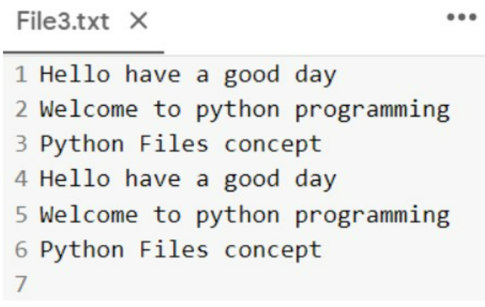
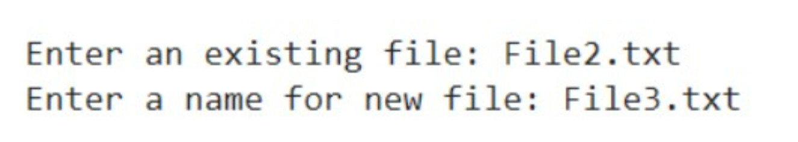

# copy-file
## AIM:
To write a python program for copying the contents from one file to another file.
## EQUIPEMENT'S REQUIRED: 
PC
Anaconda - Python 3.7
## ALGORITHM: 
## Step 1:
Create a function that takes two inputs, an existing file name and a new file name.

## Step 2:
Open the existing file in read mode.

## Step 3:
Open the new file in write mode.

## Step 4:
Read the contents on existing file using read() and store it in a variable.

## Step 5:
Copy the variable data into the new file using write().

## Step 6:
Call the function.

### OUTPUT:

### Output of the code (to receive input):

## RESULT:
Thus the program is written to copy the contents from one file to another file.